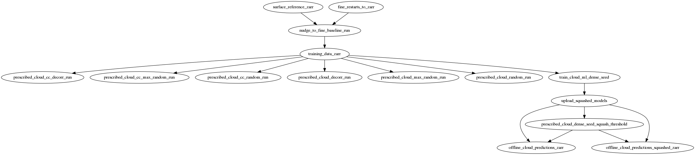

# radiation-cloud-ML-workflow
Workflow reproducibility repo for the radiation-cloud ML manuscript submitted to JAMES, organized as follows:
```
.
├── LICENSE
├── Makefile
├── README.md
├── fv3net
└── workflows
    ├── fine-restarts-to-zarr
    ├── install_kustomize.sh
    ├── kustomization.yaml
    ├── prognostic-run
    └── training
└── scripts
└── notebooks
```

### Getting started

Running `make update_submodule` will clone and update a copy of the code used in the manuscript, into a submodule called `fv3net`. This submodule includes both Python code and the Fortran FV3GFS model code. 

Then, `make create_environment` will create an environment that can execute the figure notebooks located in `./notebooks`.

### Workflow and script reproducibility

The following diagram shows the order of workflows and scripts in the manuscript, using the names of rules defined in the Makefile.


The individual steps are executed using the workflows and Python scripts located `./workflows` and `/.scripts`, respectively. 

### Requirements for accessing data and cloud computing resources

The workflows and scripts assume access to about 200GB of coarsened fine-grid SHiELD restart and diagnostics files located on Google Cloud Storage.

To obtain acess to a copy of these data, please contact the corresponding author, brianhenn@allenai.org (the requester will be responsible for data access charges on GCS).

The workflows and scripts here also require the ability to write out intermediate data and results to GCS.

Additionaly, the Makefile rules use [Argo Workflows](https://github.com/argoproj/argo-workflows) to execute them on a Google Cloud Platform Kubernetes cluster. The user must have such a cluster deployed in order to execute these workflows themselves.

However, the workflows simply run commands in Docker images, so the work plausibly could be reproduced locally as well with Docker, without Argo and Kubernetes resources.
